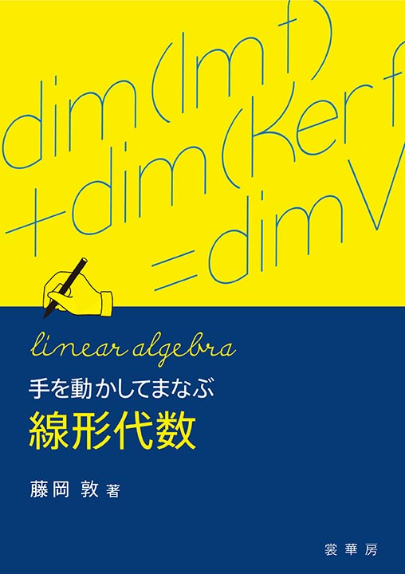

class: inverse, middle

```{r, setup, include = F}
# devtools::install_github("dill/emoGG")
library(pacman)
p_load(
  broom, tidyverse,
  ggplot2, ggthemes, ggforce, ggridges,
  latex2exp, viridis, extrafont, gridExtra,
  kableExtra, snakecase, janitor,
  data.table, dplyr,
  lubridate, knitr,
  estimatr, here, magrittr, 
  Cairo
)
# Define pink color
red_pink <- "#e64173"
turquoise <- "#20B2AA"
orange <- "#FFA500"
red <- "#fb6107"
blue <- "#3b3b9a"
green <- "#8bb174"
grey_light <- "grey70"
grey_mid <- "grey50"
grey_dark <- "grey20"
purple <- "#6A5ACD"
slate <- "#314f4f"
# Dark slate grey: #314f4f
# Knitr options
opts_chunk$set(
  comment = "#>",
  fig.align = "center",
  fig.height = 7,
  fig.width = 10.5,
  warning = F,
  message = F
)

options(crayon.enabled = F)
options(knitr.table.format = "html")
# A blank theme for ggplot
theme_empty <- theme_bw() + theme(
  line = element_blank(),
  rect = element_blank(),
  strip.text = element_blank(),
  axis.text = element_blank(),
  plot.title = element_blank(),
  axis.title = element_blank(),
  plot.margin = structure(c(0, 0, -0.5, -1), unit = "lines", valid.unit = 3L, class = "unit"),
  legend.position = "none"
)
theme_simple <- theme_bw() + theme(
  line = element_blank(),
  panel.grid = element_blank(),
  rect = element_blank(),
  strip.text = element_blank(),
  axis.text.x = element_text(size = 18, family = "STIXGeneral"),
  axis.text.y = element_blank(),
  axis.ticks = element_blank(),
  plot.title = element_blank(),
  axis.title = element_blank(),
  # plot.margin = structure(c(0, 0, -1, -1), unit = "lines", valid.unit = 3L, class = "unit"),
  legend.position = "none"
)
theme_axes_math <- theme_void() + theme(
  text = element_text(family = "MathJax_Math"),
  axis.title = element_text(size = 22),
  axis.title.x = element_text(hjust = .95, margin = margin(0.15, 0, 0, 0, unit = "lines")),
  axis.title.y = element_text(vjust = .95, margin = margin(0, 0.15, 0, 0, unit = "lines")),
  axis.line = element_line(
    color = "grey70",
    size = 0.25,
    arrow = arrow(angle = 30, length = unit(0.15, "inches")
  )),
  plot.margin = structure(c(1, 0, 1, 0), unit = "lines", valid.unit = 3L, class = "unit"),
  legend.position = "none"
)
theme_axes_serif <- theme_void() + theme(
  text = element_text(family = "MathJax_Main"),
  axis.title = element_text(size = 22),
  axis.title.x = element_text(hjust = .95, margin = margin(0.15, 0, 0, 0, unit = "lines")),
  axis.title.y = element_text(vjust = .95, margin = margin(0, 0.15, 0, 0, unit = "lines")),
  axis.line = element_line(
    color = "grey70",
    size = 0.25,
    arrow = arrow(angle = 30, length = unit(0.15, "inches")
  )),
  plot.margin = structure(c(1, 0, 1, 0), unit = "lines", valid.unit = 3L, class = "unit"),
  legend.position = "none"
)
theme_axes <- theme_void() + theme(
  text = element_text(family = "Fira Sans Book"),
  axis.title = element_text(size = 18),
  axis.title.x = element_text(hjust = .95, margin = margin(0.15, 0, 0, 0, unit = "lines")),
  axis.title.y = element_text(vjust = .95, margin = margin(0, 0.15, 0, 0, unit = "lines")),
  axis.line = element_line(
    color = grey_light,
    size = 0.25,
    arrow = arrow(angle = 30, length = unit(0.15, "inches")
  )),
  plot.margin = structure(c(1, 0, 1, 0), unit = "lines", valid.unit = 3L, class = "unit"),
  legend.position = "none"
)
theme_set(theme_gray(base_size = 20))
# Column names for regression results
reg_columns <- c("Term", "Est.", "S.E.", "t stat.", "p-Value")
# Function for formatting p values
format_pvi <- function(pv) {
  return(ifelse(
    pv < 0.0001,
    "<0.0001",
    round(pv, 4) %>% format(scientific = F)
  ))
}
format_pv <- function(pvs) lapply(X = pvs, FUN = format_pvi) %>% unlist()
# Tidy regression results table
tidy_table <- function(x, terms, highlight_row = 1, highlight_color = "black", highlight_bold = T, digits = c(NA, 3, 3, 2, 5), title = NULL) {
  x %>%
    tidy() %>%
    select(1:5) %>%
    mutate(
      term = terms,
      p.value = p.value %>% format_pv()
    ) %>%
    kable(
      col.names = reg_columns,
      escape = F,
      digits = digits,
      caption = title
    ) %>%
    kable_styling(font_size = 20) %>%
    row_spec(1:nrow(tidy(x)), background = "white") %>%
    row_spec(highlight_row, bold = highlight_bold, color = highlight_color)
}
```

```{css, echo = F, eval = T}
@media print {
  .has-continuation {
    display: block !important;
  }
}
```

$$
\begin{align}
  \def\ci{\perp\mkern-10mu\perp}
\end{align}
$$

# Introduction

---
name: intro

# Preface

## 紹介している本について

- これまで(少しは)読んだことがあるものを紹介
- ある程度評判が高いものが多い

## 簡単な振り返り

- 計量経済学(特に統計的因果推論)を習得するための補助教材として使用
- 統計学は難しい. 入門レベルでは, 数学的な計算は難しくなくても, 何をしているのか不明なことが多い
- 岸田は多くの実践(データ分析)を経験し, 理解を深めることができた
- 大数の法則と中心極限定理はとても大切
- ネットには大学教授が公開している講義ノートPDFが溢れている(英語圏は特に豊富)


---

name: intro

# 統計学と数学のバランス(個人的意見)

## Balance between math and stats

- レベルや嗜好により, 数学のテキストを使用すべきかどうかは異なる 
- しかし, 線形代数と微積は必ず必要


## Potential pitfalls

- 数学にハマり, 数学ばかり勉強してしまう
- 統計学における数学は, スポーツにおける筋トレ
- ある程度必要だが, やりすぎても実践練習がなければ生かせない 


## How to get started

.hi[Plan 1:] 統計学入門書 &rarr; 必要に応じて数学書 (線形と微積の基礎がある場合)   
.hi[Plan 2:] 線形と微積テキストから(ベクトルや微分が.grey-vlight[全く]分からない場合)  
.hi[Plan 3:] 1と2のmix. これが現実的?


---
layout: false
class: middle, inverse

# Statistics Textbooks
---
name: stats

# 入門書

.pull-left[
.hi-slate[基本統計学(第3版)] [\[link\]](https://www.amazon.co.jp/%E5%9F%BA%E6%9C%AC%E7%B5%B1%E8%A8%88%E5%AD%A6-%E7%AC%AC3%E7%89%88-%E8%B0%B7%E5%B4%8E-%E4%B9%85%E5%BF%97/dp/4492470832/ref=sr_1_3?__mk_ja_JP=%E3%82%AB%E3%82%BF%E3%82%AB%E3%83%8A&dchild=1&keywords=%E5%9F%BA%E6%9C%AC%E7%B5%B1%E8%A8%88%E5%AD%A6&qid=1605936547&s=books&sr=1-3)
<br>*谷崎他, 2010* 
```{R, stats1, out.width = "48%", echo = F}

```
]
.pull-right[
.hi-slate[統計学入門 (基礎統計学Ⅰ) ] [\[link\]](https://www.amazon.co.jp/%E7%B5%B1%E8%A8%88%E5%AD%A6%E5%85%A5%E9%96%80-%E5%9F%BA%E7%A4%8E%E7%B5%B1%E8%A8%88%E5%AD%A6%E2%85%A0-%E6%9D%B1%E4%BA%AC%E5%A4%A7%E5%AD%A6%E6%95%99%E9%A4%8A%E5%AD%A6%E9%83%A8%E7%B5%B1%E8%A8%88%E5%AD%A6%E6%95%99%E5%AE%A4/dp/4130420658/ref=sr_1_1?__mk_ja_JP=%E3%82%AB%E3%82%BF%E3%82%AB%E3%83%8A&dchild=1&keywords=%E7%B5%B1%E8%A8%88%E5%AD%A6%E5%85%A5%E9%96%80+%28%E5%9F%BA%E7%A4%8E%E7%B5%B1%E8%A8%88%E5%AD%A6%E2%85%A0%29&qid=1605936912&s=books&sr=1-1)
<br>*東京大学教養学部統計学教室, 1991* 
```{R, stats2, out.width = "45%", echo = F}

```
]

.pull-left[解説が丁寧でかなり分かりやすい. 文系学部の1~3年生レベル. 若干, 帯に短し襷に長しという感じ.]

.pull-right[最も定番の入門書. 文系学部の2~4年生レベル. 統計検定の副読本としても有名. 入門書と言われている中では難しい方に分類. やり込めば力がつく.]


---

name: stats

# 数理統計学.super[.pink[†]]

.pull-left[
.hi-slate[現代数理統計学の基礎] [\[link\]](https://www.amazon.co.jp/%E7%8F%BE%E4%BB%A3%E6%95%B0%E7%90%86%E7%B5%B1%E8%A8%88%E5%AD%A6%E3%81%AE%E5%9F%BA%E7%A4%8E-%E5%85%B1%E7%AB%8B%E8%AC%9B%E5%BA%A7-%E6%95%B0%E5%AD%A6%E3%81%AE%E9%AD%85%E5%8A%9B-%E4%B9%85%E4%BF%9D%E5%B7%9D-%E9%81%94%E4%B9%9F/dp/4320111664/ref=sr_1_4?__mk_ja_JP=%E3%82%AB%E3%82%BF%E3%82%AB%E3%83%8A&dchild=1&keywords=%E6%95%B0%E7%90%86%E7%B5%B1%E8%A8%88%E5%AD%A6&qid=1605939039&sr=8-4)
<br>*久保川, 2017* 
```{R, stats3, out.width = "45%", echo = F}

```
]
.pull-right[
.hi-slate[計量経済学のための数学] [\[link\]](https://www.amazon.co.jp/%E8%A8%88%E9%87%8F%E7%B5%8C%E6%B8%88%E5%AD%A6%E3%81%AE%E3%81%9F%E3%82%81%E3%81%AE%E6%95%B0%E5%AD%A6-%E7%94%B0%E4%B8%AD-%E4%B9%85%E7%A8%94/dp/4535559295/ref=sr_1_1?__mk_ja_JP=%E3%82%AB%E3%82%BF%E3%82%AB%E3%83%8A&crid=2G16XZAFF1IZU&dchild=1&keywords=%E8%A8%88%E9%87%8F%E7%B5%8C%E6%B8%88%E5%AD%A6%E3%81%AE%E3%81%9F%E3%82%81%E3%81%AE%E6%95%B0%E5%AD%A6&qid=1605939666&sprefix=%E8%A8%88%E9%87%8F%E7%B5%8C%E6%B8%88%E5%AD%A6%E3%81%AE%E3%81%9F%E3%82%81%E3%81%AE%2Caps%2C276&sr=8-1)
<br>*田中, 2019* 
```{R, stats4, out.width = "45%", echo = F}

```
]

.pull-left[前半で確率・積立母関数や多くの確率分布が紹介されている. 比較的解説が丁寧. 統計検定1級の副読本としても人気.]

.pull-right[タイトルを数理統計学に置き換えても問題なし. 統計学に必要な集合, 線形代数, 期待値, 大数の法則, 中心極限定理がまとめられている.]

.footnote[
<br>.pink[†] そこそこの微積・線形代数の知識がないと読み進めることはできない.
]


---

name: stats

# 読み物

.pull-left[
.hi-slate[統計学が最強の学問である] [\[link\]](https://www.amazon.co.jp/%E7%B5%B1%E8%A8%88%E5%AD%A6%E3%81%8C%E6%9C%80%E5%BC%B7%E3%81%AE%E5%AD%A6%E5%95%8F%E3%81%A7%E3%81%82%E3%82%8B-%E8%A5%BF%E5%86%85-%E5%95%93/dp/4478022216)
<br>*西内, 2013* 
```{R, stats5, out.width = "48%", echo = F}

```
]
.pull-right[
.hi-slate[データ分析の力 因果関係に迫る思考法] [\[link\]](https://www.amazon.co.jp/%E3%83%87%E3%83%BC%E3%82%BF%E5%88%86%E6%9E%90%E3%81%AE%E5%8A%9B-%E5%9B%A0%E6%9E%9C%E9%96%A2%E4%BF%82%E3%81%AB%E8%BF%AB%E3%82%8B%E6%80%9D%E8%80%83%E6%B3%95-%E5%85%89%E6%96%87%E7%A4%BE%E6%96%B0%E6%9B%B8-%E4%BC%8A%E8%97%A4-%E5%85%AC%E4%B8%80%E6%9C%97-ebook/dp/B071CD9CMP/ref=sr_1_1?__mk_ja_JP=%E3%82%AB%E3%82%BF%E3%82%AB%E3%83%8A&dchild=1&keywords=%E4%BC%8A%E8%97%A4%E3%81%93%E3%81%86%E3%81%84%E3%81%A1%E3%82%8D%E3%81%86&qid=1605938677&sr=8-1) *伊藤, 2017* 
```{R, stats6, out.width = "45%", echo = F}

```
]


.pull-left[統計学の歴史や, ビジネスや学術での応用について知れる. 寄り道本. ビジネス, 実践, 数学編も販売されている.]

.pull-right[因果推論に関心があればぜひ...!]


---
layout: false
class: inverse, middle

# Probability Theory Textbooks
---
name: prob

# 確率論.super[.pink[†]]

.pull-left[
.hi-slate[確率論 講義ノート] [\[link\]](https://www.amazon.co.jp/%E7%A2%BA%E7%8E%87%E8%AB%96-%E8%AC%9B%E7%BE%A9%E3%83%8E%E3%83%BC%E3%83%88-%E5%A0%B4%E5%90%88%E3%81%AE%E6%95%B0%E3%81%8B%E3%82%89%E7%A2%BA%E7%8E%87%E5%BE%AE%E5%88%86%E6%96%B9%E7%A8%8B%E5%BC%8F%E3%81%BE%E3%81%A7-%E5%A4%A7%E5%B9%B3-%E5%BE%B9/dp/4627077718/ref=sr_1_9?__mk_ja_JP=%E3%82%AB%E3%82%BF%E3%82%AB%E3%83%8A&dchild=1&keywords=%E7%A2%BA%E7%8E%87%E8%AB%96&qid=1605940377&sr=8-9)
<br>*太平, 2017* 
```{R, prob1, out.width = "48%", echo = F}

```
]
.pull-right[
.hi-slate[測度・確率・ルベーグ積分] [\[link\]](https://www.amazon.co.jp/%E6%B8%AC%E5%BA%A6%E3%83%BB%E7%A2%BA%E7%8E%87%E3%83%BB%E3%83%AB%E3%83%99%E3%83%BC%E3%82%B0%E7%A9%8D%E5%88%86-%E5%BF%9C%E7%94%A8%E3%81%B8%E3%81%AE%E6%9C%80%E7%9F%AD%E3%82%B3%E3%83%BC%E3%82%B9-KS%E7%90%86%E5%B7%A5%E5%AD%A6%E5%B0%82%E9%96%80%E6%9B%B8-%E5%8E%9F-%E5%95%93%E4%BB%8B/dp/4061565710/ref=sr_1_12?__mk_ja_JP=%E3%82%AB%E3%82%BF%E3%82%AB%E3%83%8A&dchild=1&keywords=%E7%A2%BA%E7%8E%87%E8%AB%96&qid=1605940377&sr=8-12)
<br>*原, 2017* 
```{R, prob2, out.width = "45%", echo = F}

```
]


.pull-left[確率とは何かを知りたい場合に. 古典的・公理的アプローチ. ベイズも少し知れる.]

.pull-right[確率論の基礎づけに必要な測度論の本. 岸田はすぐ挫折. E資格の勉強としてはいいかも?]

.footnote[
<br>.pink[†] 確率論入門というようなタイトルのテキストもあるが, 入門レベルは統計学テキストに含まれている章で十分であると思う. これらの本は中級あたり.
]


---
layout: false
class: inverse, middle

# Mathematics Textbooks
---
name: math

# 線形代数・微分積分

.pull-left[
.hi-slate[手を動かしてまなぶ 線形代数] [\[link\]](https://www.shokabo.co.jp/mybooks/ISBN978-4-7853-1564-1.htm)
<br>*藤岡, 2015* 
```{R, math1, out.width = "48%", echo = F}

```
]
.pull-right[
.hi-slate[手を動かしてまなぶ 微分積分] [\[link\]](https://www.shokabo.co.jp/mybooks/ISBN978-4-7853-1581-8.htm)
<br>*藤岡, 2019* 
```{R, math2, out.width = "48%", echo = F}

```
]


.pull-left[本文と練習問題の解答解説が懇切丁寧. マセマ(次ページ)が入門書では最も有名だが, 個人的にはこれがおすすめ.]

.pull-right[こちらは使用していないが, 同じ著者のため, 良書間違いなしと思われる.]


---
name: math

# 線形代数・微分積分

.pull-left[
.hi-slate[線形代数キャンパス・ゼミ] [\[link\]](https://www.amazon.co.jp/%E7%B7%9A%E5%BD%A2%E4%BB%A3%E6%95%B0%E3%82%AD%E3%83%A3%E3%83%B3%E3%83%91%E3%82%B9%E3%83%BB%E3%82%BC%E3%83%9F-%E6%94%B9%E8%A8%828-%E9%A6%AC%E5%A0%B4-%E6%95%AC%E4%B9%8B/dp/4866151633/ref=sr_1_2?__mk_ja_JP=%E3%82%AB%E3%82%BF%E3%82%AB%E3%83%8A&dchild=1&keywords=%E7%B7%9A%E5%BD%A2%E4%BB%A3%E6%95%B0&qid=1605943690&sr=8-2)
<br>*馬場, 2020* 
```{R, math3, out.width = "48%", echo = F}

```
]
.pull-right[
.hi-slate[チャート式シリーズ 大学教養 微分積分] [\[link\]](https://www.amazon.co.jp/%E3%83%81%E3%83%A3%E3%83%BC%E3%83%88%E5%BC%8F%E3%82%B7%E3%83%AA%E3%83%BC%E3%82%BA-%E5%A4%A7%E5%AD%A6%E6%95%99%E9%A4%8A-%E5%BE%AE%E5%88%86%E7%A9%8D%E5%88%86-%E3%83%81%E3%83%A3%E3%83%BC%E3%83%88%E5%BC%8F%E3%83%BB%E3%82%B7%E3%83%AA%E3%83%BC%E3%82%BA-%E5%8A%A0%E8%97%A4/dp/4410152300/ref=pd_bxgy_img_2/355-9334085-1520134?_encoding=UTF8&pd_rd_i=4410152300&pd_rd_r=da1eafd6-1dbc-4265-8ce7-b6626df7ccca&pd_rd_w=XDPbz&pd_rd_wg=npg0Q&pf_rd_p=e64b0a81-ca1b-4802-bd2c-a4b65bccc76e&pf_rd_r=RVVFGM6CR24S50C9Y9M1&psc=1&refRID=RVVFGM6CR24S50C9Y9M1)
*加藤, 2019* 
```{R, math4, out.width = "48%", echo = F}

```
]


.pull-left[長く定番となっているマセマシリーズ. 文系学部1~2年レベルの範囲をカバー. 微分積分版もある.]

.pull-right[昨年出版であるのに, 数学書としてはAmazonレビューが異常(現在68). 神本としてTwitterでも盛り上がり, 学生や大人が購入していた. 線形代数版もある.]


---
name: math

# 線形代数・微分積分

.pull-left[
.hi-slate[線形代数学（新装版）] [\[link\]](https://www.amazon.co.jp/%E7%B7%9A%E5%BD%A2%E4%BB%A3%E6%95%B0%E5%AD%A6%EF%BC%88%E6%96%B0%E8%A3%85%E7%89%88%EF%BC%89-%E5%B7%9D%E4%B9%85%E4%BF%9D-%E5%8B%9D%E5%A4%AB/dp/4535786542/ref=sr_1_13?__mk_ja_JP=%E3%82%AB%E3%82%BF%E3%82%AB%E3%83%8A&dchild=1&keywords=%E7%B7%9A%E5%BD%A2%E4%BB%A3%E6%95%B0&qid=1605944368&sr=8-13)
<br>*川久保, 2010* 
```{R, math5, out.width = "48%", echo = F}

```
]
.pull-right[
.hi-slate[基礎数学1 線型代数入門] [\[link\]](https://www.amazon.co.jp/%E5%9F%BA%E7%A4%8E%E6%95%B0%E5%AD%A61%E7%B7%9A%E5%9E%8B%E4%BB%A3%E6%95%B0%E5%85%A5%E9%96%80-%E9%BD%8B%E8%97%A4%E6%AD%A3%E5%BD%A6-ebook/dp/B07HWS9GTK/ref=sr_1_4?__mk_ja_JP=%E3%82%AB%E3%82%BF%E3%82%AB%E3%83%8A&dchild=1&keywords=%E7%B7%9A%E5%BD%A2%E4%BB%A3%E6%95%B0&qid=1605944368&sr=8-4)
<br>*齋藤, 2019* 
```{R, math6, out.width = "48%", echo = F}

```
]


.pull-left[マセマやチャート式よりは若干難しい. 軽くかじった程度. 主に副読本として利用. 右のテキストとどちらか1冊あれば良いくらい (岸田なら買わない).]

.pull-right[左と同じ.]


---


exclude: true

```{R, generate pdfs, include = F, eval = T}
pagedown::chrome_print("math_stats_book.html", output = "math_stats_book.pdf")
```

